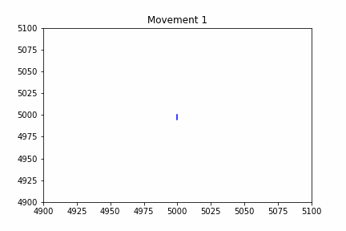

# Exercices

## Jeu du + ou +

``` python
# Importer les librairies
from random import randint
# Generer un nombre aleatoire et d'autres variable
nbAdeviner = randint(1,200)
chercheToujours = True
c = 0
# Demarrer la boucle
while (chercheToujours):
    print('')
    # Entrezun chiffre
    n = int(input("Entrez un nombre ==> "))
    # Agir en fonction du résultat
    if n > nbAdeviner:
        print("c'est moins !")
        c += 1
    elif n < nbAdeviner:
        print("c'est plus !")
        c += 1
    else:
        print ('Bingo, vous avez trouvé en '+str(c + 1)+' coup(s)')
```

### Amélioration du jeu du + ou du - 

- Limiter le nombre de tentatives à 10 essais maximum. Après 10 essais, si l’utilisateur n’a pas trouvé, le programme indique qu’il a perdu et révèle le nombre.
- Permettre à l'utilisateur de choisir la plage de nombres (par exemple, entre 1 et 1000).

## Exercice du marcheur ivre 

À chaque itération, le marcheur, ivre, peut se déplacer vers l'Est, l'Ouest, le Nord ou le Sud.
La direction est déterminée de manière aléatoire à chaque itération (par exemple, 100 ou 10 000 déplacements avant l'arrêt, car trop ivre).

Le point de départ est le Gros Horloge, situé aux coordonnées (121475.93, 6350115.88, EPSG::3857).



### Amélioration du jeu du marcheur ivre 

- Vous pouvez modifier la vitesse du marcheur à chaque itération (par exemple, il peut se mettre à courir ou marcher de plus en plus lentement).
- Autre possibilité d'amélioration : créer des obstacles dans l'environnement de simulation ou définir des limites à cet environnement.
- Ajouter un deuxième marcheur ivre.
- Fixer une destination et observer combien de temps il met à l'atteindre.
- Ajouter une mémoire au marcheur (après tout, il n'est peut-être pas si ivre que ça).
- ...

  ```
  import random
import matplotlib.pyplot as plt
import os

# Position du marcheur
x = [5000]
y = [5000]
# Nombre mouvements
nOfMouv = 100

# Debuter la marche 
for i in range(nOfMouv):
    print('Mouvement ', i)
    direction = random.choice(['N', 'O', 'S', 'E'])
    
    if direction == 'O':
        print('GOOOO ===> Ouest')
        x.append(x[-1] - 5)
        y.append(y[-1])
    elif direction == 'N':
        print('GOOOO ===> Nord')
        y.append(y[-1] + 5)
        x.append(x[-1])
    elif direction == 'E':
        print('GOOOO ===> Est')
        x.append(x[-1] + 5)
        y.append(y[-1])
    else:
        print('GOOOO ===> Sud')
        y.append(y[-1] - 5)
        x.append(x[-1])

    # Plot and save each iteration as an image
    plt.plot(x, y, color='blue')
    plt.xlim(4900, 5100)  # Fix x-axis limits to keep it stable
    plt.ylim(4900, 5100)  # Fix y-axis limits to keep it stable
    plt.title(f'Movement {i+1}')
    plt.show()
```
