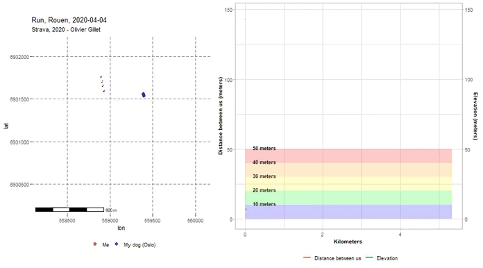

# **Créer une trace "GPS"**

Vous devez réaliser le suivi **fictif** GPS de la divagation d'une araignée quelconque dans une zone d'étude donnée pendant 1 heure (balise argos par exemple).

Les outputs attendus sont:
- Un shapefile avec une ligne représentant le déplacement de l'animal.
- Un shapefile de points avec plusieurs attributs (ID, datetime, X, Y,speed) comme un **GPX**

| ID | dateTime        | X      | Y       |speed |
| :--|:---------------:| :-----:| :------:| ----:|
| 1  | 24112021 145633 | 381046 | 6557972 |
| 2  | 24112021 145635 | 381048 | 6557985 |6km/h |
| 3  | 24112021 145637 | 381058 | 6557995 |5km/h |

**Niveau 2**. Vous devez ajouter des temps de pause et de la fatigue (diminution de la vitesse de déplacement). Ainsi vous pouvez calculer des statistiques telles que l'allure, la distance totale ou la durée totale des pauses.  

**Niveau 3**. Vous pouvez ajouter des obstables tels que des arbres si c'est un animal terrestre par exemple. Cela nécessite de créer des objets spatialisés (points, polygones ou lignes) et de réaliser des **géotraitements** comme des zones tampons ou des intersections.  

