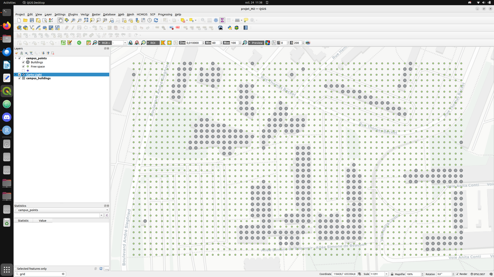

# GDAL/OGR
* Cheatsheet GDAL <a href="images/GDAL_CHEATSHEET_2020.pdf" download>Cliquez ici pour le télécharger</a>
* Cheatsheet OGR <a href="images/OGR_CHEATSHEET_2020.pdf" download>Cliquez ici pour le télécharger</a>

Pour plus d'informations sur la manipulation des objets spatiaux et des méthodes associées, voici deux sites:
- [Le site de Jared Erickson, Cort Daniel et Michael Payne](https://pcjericks.github.io/py-gdalogr-cookbook/index.html)  
- [Le site de GDAL](https://gdal.org/en/latest/) 


``` python
###########################################################
###########################################################
####                     PROJET                        ####
####                                                   ####
###########################################################
###########################################################

###############################################################################
# ==============================================================================
# Import des librairies et des fonctions externes
# ==============================================================================
###############################################################################

import numpy as np
import matplotlib.pyplot as plt
from osgeo import gdal, ogr, osr
import os

###############################################################################
# ==============================================================================
# Script principal
# ==============================================================================
###############################################################################

# Fixer un repertoire de travail
os.chdir("/home/gilleol2/Desktop/MASTER_2")

#Initialiser un driver pour gerer le futur fichier
driver = ogr.GetDriverByName("ESRI Shapefile")

#Definir un nom pour le nouveau shapefile
output = "start.shp"

#Supprimer shapefile si il existe deja
if os.path.exists(output):
    driver.DeleteDataSource(output)
    
#Creer les sources de donnee avec la methode CreateDataSource
ds = driver.CreateDataSource(output)

#Importer le src depuis la librairie osr
spatialref = osr.SpatialReference()  # Fixe le scr
spatialref.ImportFromEPSG(3857)

#Creer la couche ou le layer avec la methode CreateLayer
layer = ds.CreateLayer('Point', spatialref, geom_type=ogr.wkbPoint)

#Ajouter un champ dans la table attributaire
#Definir l'attribut (FieldDefn)
fielddef = ogr.FieldDefn("ID", ogr.OFTInteger)
#Ajouter l'attribut a la table (CreateField)
layer.CreateField(fielddef)

# Créer l'entité
point = ogr.Geometry(ogr.wkbPoint)
# Fixer le point dans l'espace
point.AddPoint(121475.93, 6350115.88)
# Ajouter les attributs et contruire l'entité 
featureDefn = layer.GetLayerDefn()
feature = ogr.Feature(featureDefn)
feature.SetGeometry(point)
feature.SetField('ID', 1)
layer.CreateFeature(feature)

# Supprimer les fichier temporaires
del layer, ds               

iface.addVectorLayer("start.shp", "start", "ogr")

```
## Exercices

### Exercice du 25/10/2024
Vous devez projeter dans l'espace l'itinéraire de votre marcheur ivre.  
Vous pouvez mobiliser le code ci-dessus ainsi que celui du [marcheur ivre](./exercice_2.html).  
Amélioration n°1: Définir une bounding box à l'environnement de simulation.  

### Exercice du 07/11/2024
L'image suivante montre l'environnement dans lequel se déplacera mon marcheur ivre :

    -Il s'agit du campus.
    -La résolution spatiale est de 10 mètres.
    -Les points sont soit des 'free spaces' ou des 'buildings'. Ces derniers constituent des obstacles pour les marcheurs.



A vous de créer votre environnement de simulation.  
⚠️⚠️⚠️⚠️ Exercice à réaliser pour la prochaine séance. ⚠️⚠️⚠️⚠️  


``` python
###########################################################
###########################################################
####                     PROJET                        ####
####                                                   ####
###########################################################
###########################################################

###############################################################################
# ==============================================================================
# Import des librairies et des fonctions externes
# ==============================================================================
###############################################################################

import numpy as np
import matplotlib.pyplot as plt
from osgeo import gdal, ogr, osr
import os

###############################################################################
# ==============================================================================
# Script principal
# ==============================================================================
###############################################################################

# Fixer un repertoire de travail
os.chdir("/home/gilleol2/Desktop/MASTER_2")

#Initialiser un driver pour gerer le futur fichier
driver = ogr.GetDriverByName("ESRI Shapefile")

#Definir un nom pour le nouveau shapefile
output = "line.shp"

#Supprimer shapefile si il existe deja
if os.path.exists(output):
    driver.DeleteDataSource(output)
    
#Creer les sources de donnee avec la methode CreateDataSource
ds = driver.CreateDataSource(output)

#Importer le src depuis la librairie osr
spatialref = osr.SpatialReference()  # Fixe le scr
spatialref.ImportFromEPSG(3857)

#Creer la couche ou le layer avec la methode CreateLayer
layer = ds.CreateLayer('Line', spatialref, geom_type=ogr.wkbLineString)

# Ajouter un champ dans la table attributaire
# Definir l'attribut (FieldDefn)
fielddef = ogr.FieldDefn("id", ogr.OFTString)
# Ajouter l'attribut a la table (CreateField)
layer.CreateField(fielddef)

# Créer l'entité
line = ogr.Geometry(ogr.wkbLineString)

# Ajouter des points 
line.AddPoint(121475.93, 6350115.88)
line.AddPoint(121485.93, 6350115.88)
line.AddPoint(121495.93, 6350125.88)

featureDefn = layer.GetLayerDefn()
feature = ogr.Feature(featureDefn)
feature.SetGeometry(line)
feature.SetField('id', 1)
layer.CreateFeature(feature)

# Supprimer les fichier temporaires
del layer, ds               

iface.addVectorLayer("line.shp", "line", "ogr")

```

``` python
###########################################################
###########################################################
####                  Ouvrir shapefile                 ####
###########################################################
###########################################################

# Ouvrir le shapefile de notre zone d'etude 
DriverName = "ESRI Shapefile"      # e.g.: GeoJSON, ESRI Shapefile
FileName = "env_simulation.shp"
driver = ogr.GetDriverByName('ESRI Shapefile')
dataSource = driver.Open(FileName, 0) # 0 means read-only. 1 means writeable.

# Vérifier l'ouveture du shapefile
if dataSource is None:
    print('Could not open %s' % (FileName))
else:
    print('Opened %s' % (FileName))
    layer = dataSource.GetLayer()
    featureCount = layer.GetFeatureCount()
    print("Number of features in %s: %d" % (os.path.basename(FileName),featureCount))
```

``` python
###########################################################
###########################################################
####            Realisation une intersection           ####
###########################################################
###########################################################

wkt = "POINT (%d %d)" % (xCoordPosition, YCoordPosition)
pt = ogr.CreateGeometryFromWkt(wkt)
buffer = pt.Buffer(5)

intersecting_points = [] 
for feature in layerEnvironment:
    geom = feature.GetGeometryRef()
    attribute_value = feature.GetField("type") 
    if geom.Intersects(buffer) and attribute_value != "Free space":
        print(f"Intersecting point: {geom.ExportToWkt()}")
        break 
```


``` python
###########################################################
###########################################################
####            Creer un tableau de donnees            ####
###########################################################
###########################################################
import csv

# Creer un tableau pour stocker les donnees
data = [
    ["number_simulation", "distancePreviousLocation", "distance"]
]

# Ajouter des donnees
tmpData = [1,1.8,5]
data.append(tmpData)

# Definir un nom
file_path_to_save_data = "results_simulation.csv"

# Verifier si il exsite déjà puis supprimer si c'est le cas
if os.path.exists(file_path_to_save_data):
    driver.DeleteDataSource(file_path_to_save_data)

# Ecrire les donnees
with open(file_path_to_save_data, mode='w', newline='', encoding='utf-8') as file:
    writer = csv.writer(file)
    writer.writerows(data)

```

# Dossier (en .zip) à rendre pour le vendredi 13 décembre (avant minuit sinon -3 points):
- Un rapport de trois pages avec un flowchart
- Un script python en .py (je ne veux pas de fichier texte pour exécuter le code)
- Le shapefile de votre environnement de simulation (tous les fichiers, à savoir le .shp, .dbf, .prj, .shx)

# Examen terminal de janvier 2025 :
Compléter le dossier réalisé précédemment en ajoutant des statistiques issues de votre simulation :
- Exécuter plusieurs fois votre simulation (2, 10, 10000 fois, c'est comme vous voulez)
- Enregistrer des informations à chaque itération
- Exporter les données dans un flat file (.txt, .csv)
- Réaliser des statistiques (distance moyenne cumulée parcourue, nombre d'obstacles rencontrés, etc.)  
▶️ A vous de jouer, à vous démarquer !  
⚠️⚠️⚠️⚠️ Toutes améliorations du code seront fortement appréciées (e.g ajout d'une destination, environnement de simulation plus complexe, etc.).  
⚠️⚠️⚠️⚠️ Ces nouveautés doivent détaillées dans le rapport.  

