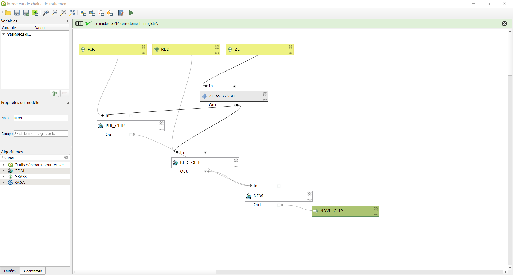
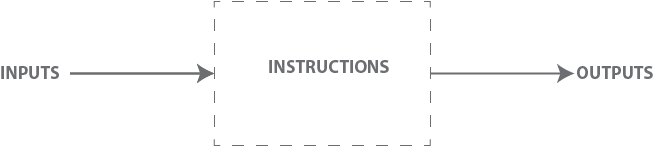
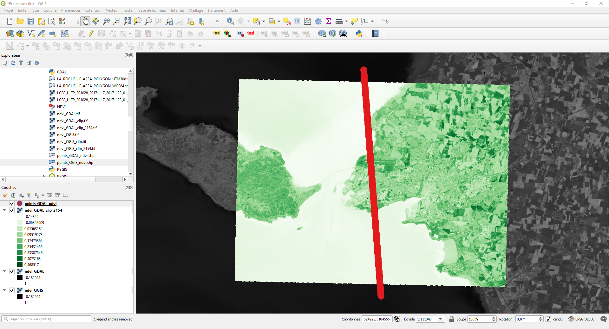

# Chaîne de traitements de QGIS

L'objectif principal est de manipuler/traiter les objects spatialisés, vecteurs comme rasteurs, via Python. L'apprentissage se veut progressif et la chaîne de traitements sera réalisée selon diverses méthodes, du 'click button' à la programmation python.

1. Métode "Click button"
2. Model Builder
3. PyGIS
4. GDAL/OGR 



***Objectifs***
- Calculer l'indice de végétation par différence normalisée (NDVI).
- Reprojeter le shapefile de notre zone d'étude (EPSG::4326 vers EPSG::4326).
- Découper l'indice de végétation à partir d'une couche de masquage. 




***Données (Inputs)***
- Image satellitaire Landsat 8 (raster, EPSG::32630)
- Donnée vectorielle délimitant la zone d'étude (vecteur, polygone, EPSG::4326)

***Instructions (outils SIG)***
1. Calculatrice raster 

```
PIR = Bande 5
ROUGE  = BANDE 4 
NDVI = (PIR-ROUGE)/(PIR+ROUGE)
Raster -> Calculatrice raster 
```

2. Reprojeter une couche

```
Vecteur -> Outils de gestion de données -> Reprojeter une couche
```

3. Découper un raster selon un couche de masquage

```
Raster -> Extraction -> Découper un raster selon un couche de masquage
```

4. Réaliser un transect vertical 
 
```
Centroïdes -> PointSamplingTool
```

***Résultats (Outputs)***
- L'indice de végétation par différence normalisée (NDVI) sur La Rochelle (donnée matricielle)
- Transect vertical contenant la valeur des NDVIs (donnée vetorielle)


