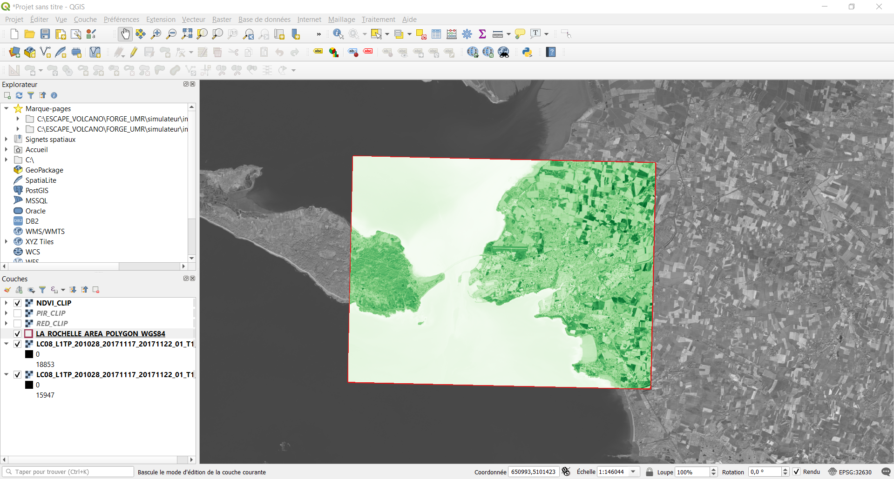

# Chaîne de traitements de QGIS

***Objectifs***
- Calculer l'indice de végétation par différence normalisée (NDVI).
- Reprojeter le shapefile de notre zone d'étude (EPSG::4326 vers EPSG::4326).
- Découper l'indice de végétation à partir d'une couche de masquage. 
L'objectif principal est de manipuler/traiter les objects spatialisés, vecteurs comme rasteurs, via Python.


***Données (Inputs)***
- Image satellite Landsat 8 de La Rochelle (raster, EPSG::32630)
- Donnée vectorielle délimitant la zone d'étude (vecteur, polygone, EPSG::4326)

***Instructions (outils SIG)***
- Calculatrice raster 
```
PIR = Bande 5
ROUGE  = BANDE 4 
NDVI = (PIR-ROUGE)/(PIR+ROUGE)
Raster -> Calculatrice raster 
```
- Reprojeter une couche
```
Vecteur -> Outils de gestion de données -> Reprojeter une couche
```
- Découper un raster selon un couche de masquage

```
Raster -> Extraction -> Découper un raster selon un couche de masquage
```
***Données (Outpus)***
- L'indice de végétation par différence normalisée (NDVI) sur La Rochelle




